# DATA LOVERS

**POKESCHOOL** es una página web basada en el popular juego de realidad aumentada Pokémon Go, donde los usuarios podrán encontrar información de datos concretos de cualquier pokémon de la región de Kanto, que serán de ayuda para mejorar sus estrategias y lograr atraparlos a todos.

## Investigación
### Etapa Previa
Al recibir el encargo tuvimos una visualización de quiénes podrían ser nuestros usuarios y determinamos el siguiente **User Persona**:

    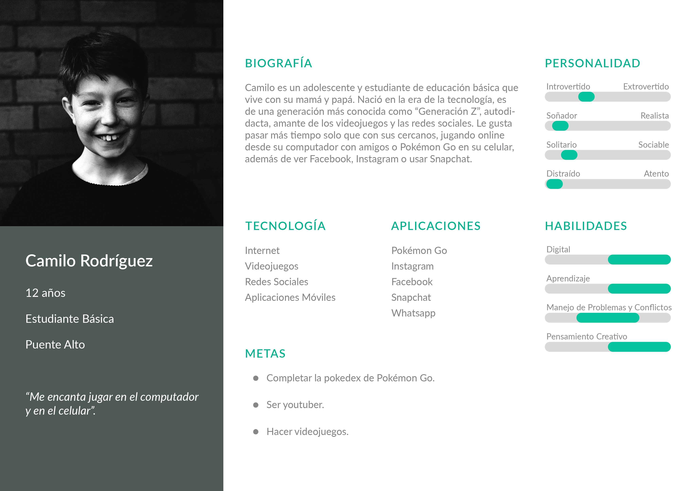

### Encuesta
Realizamos una encuesta mediante formulario de Google y respondieron 54 personas. Puedes ver las preguntas y respuestas en el siguiente link https://docs.google.com/forms/d/1-MMdlKK5gnTOEkFiUvTC_9ALCGYi_cdlEB7sJaNw3Gw/edit.

### Conclusión Encuesta

Las personas encuestadas tienen entre 10 y 49 años, siendo los adultos jóvenes quienes más participaron. Todos poseen celular, lo usan constantemente para jugar, ver redes sociales y videos; dentro de los juegos mencionados se encuentra Pokémon Go, con el que se divierten todos los días, jugando más de 2 horas. El encuentro con el lanzamiento de esta aplicación apeló mucho a su emotividad, recordando su infancia, ya que todos habían visto la serie animada Pokémon desde la primera generación (conocen algunos de los nombres de estos seres y saben que los primeros habitaban en la región de Kanto, aunque no todos saben cuántos eran de esta localidad). Consideraron que fue un nuevo juego fácil de entender, además ya se relacionaban con algunos términos: pokebola, pokedex y entendían a qué se refieren cuando se habla de tipo de pokémon. Lo que más les gusta de este videojuego de realidad aumentada es que te invita a hacer ejercicio, salir a caminar y conocer otras personas.

Esto nos lleva a formar nuestro **User Persona** que, aunque son de edades muy diversas, tienen intereses y comportamientos muy similares.

### User Persona

    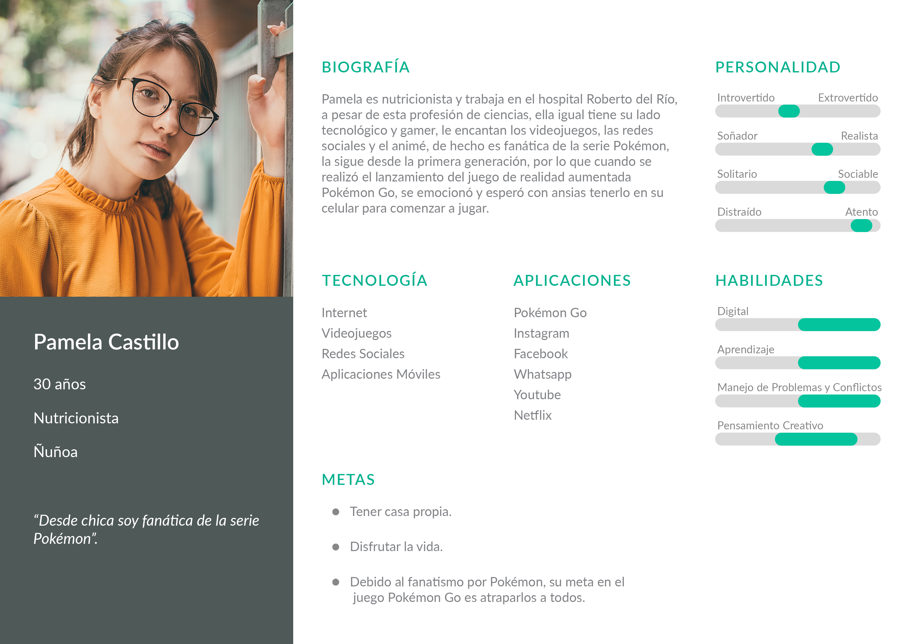

## Historias de Usuario + Definition of Done

* _"Como usuario, siendo la primera vez que ingreso a la página, necesito conocer de qué se trata para saber rápidamente si me entregará la información que ando buscando."_
  - **Mostrar** mensaje de bienvenida.

  - **Mostrar** contenido con breve introducción sobre la página.

* _"Como usuario necesito saber cómo se escribe el nombre del pokémon que quiero buscar, para no equivocarme y poder ver sus características."_
    - **Mostrar** barra de búsqueda.

    - **Interpretar** la búsqueda del usuario (mostrar barra con opciones predeterminadas).

    - Si ingresa una letra con la que no existe nombre de un pokémon, no mostrar sugerencias, mostrar **mensaje de error**.

    - Permitir **seleccionar** nombre del pokémon.

    - Acompañar la barra de búsqueda con un botón **"ok"** o presionar **"enter** para que se realice la acción.

    - **Mostrar** características, nombre e imagen del pokémon.

* _"Como jugador de Pokémon Go, necesito saber qué pokémon son tipo agua, para ganar la batalla."_

  - **Mostrar** sección "Tipos de Pokémon".

  - **Filtrar** pokemones por tipo (planta, veneno, fuego, volador, agua, bicho, normal, eléctrico, tierra, hada, lucha, psíquico, roca, acero, hielo, fantasma, dragón).

* _"Como jugador y principiante de Pokémon Go, quiero saber cuántos pokémon habitaban en la región de Kanto, para saber cuántos tengo que capturar."_
    - **Mostrar** texto que indique la cantidad de pokémon que habitan en la región de Kanto (151).

    - **Mostrar** 151 pokémon.

* _"Como usuario y un poco fanático de la serie Pokémon, quiero ver los nombres de los pokémon de la _"A"_ a la _"Z"_ para aprendérmelos."_
    - **Ordenar** por orden alfabético.

* _"Como usuario necesito ver: tipo, nombre, imagen y evolución (si es que tiene) del pokémon que busco y si aparece en huevo, para mejorar mis estrategias en el juego."_
    - **Mostrar** nombre, imagen, evolución, tipo, evolución y si aparece en huevo.

* _"Como usuario y jugador de Pokémon Go, necesito saber cuántos caramelos necesito para evolucionar a mi pokémon."_
    - **Mostrar** datos relevantes, ej: caramelos.

* _"Como usuario, tengo dudas sobre cómo puedo ver las características de un pokémon."_
    - **Mostrar** sección de ayuda.

## DISEÑO  INTERFAZ DE USUARIO

### Diagrama de Flujo
Sin tener tanta información sobre el usuario y sólo basándonos en el encargo, realizamos un primer diagrama de flujo:

    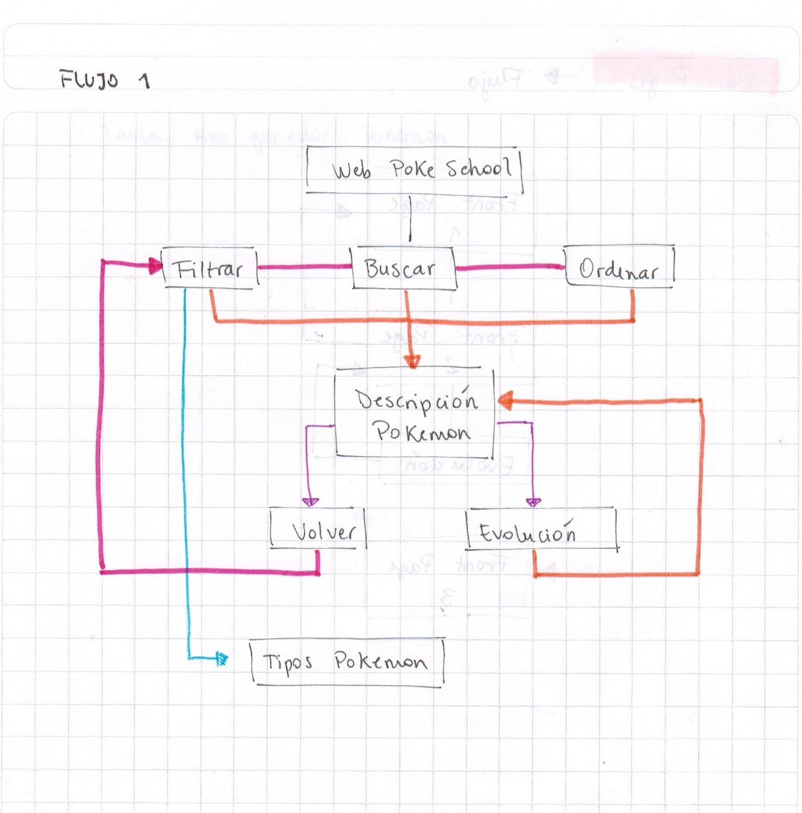

En base al encargo y a las historias de usuario determinamos lo que necesitamos mostrar y realizamos el siguiente diagrama de flujo:

    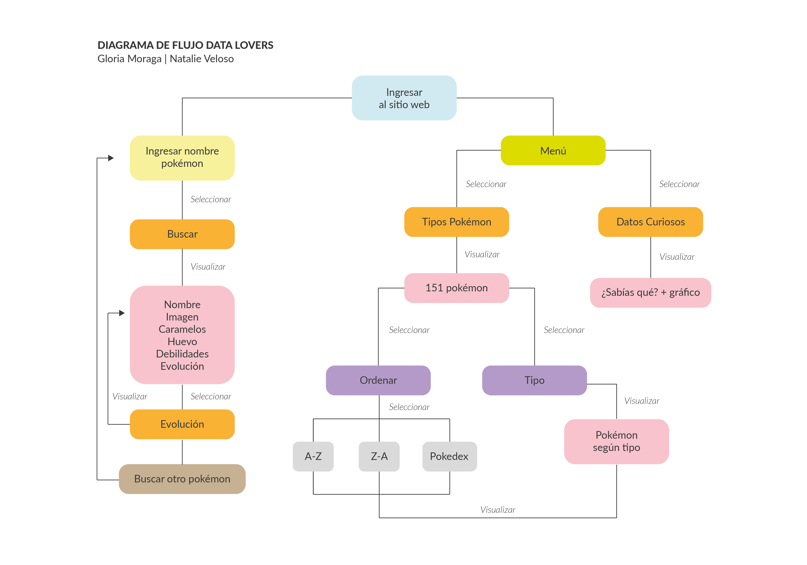

### Prototipo Baja Fidelidad
Definimos la cantidad de pantallas a utilizar, quedando en un total de 4:

| Primera Pantalla / Buscador
|--------------------------|
| Logotipo |
| Menú |
| Texto bienvenida |
| Buscador |
| Íconos posición pantalla |
| Ícono ayuda |

| Segunda Pantalla / Pokémon
|--------------------------|
| Nombre Pokémon |
| Imagen |
| Tipo |
| Caramelos |
| Huevo |
| Debilidades |
| Íconos posición pantalla |
| Ícono ayuda |

| Tercera Pantalla / Tipos Pokémon
|--------------------------|
| Barra despliegue **Tipos** |
| Barra despliegue **Ordenar** |
| 151 Pokémon |
| Nombre Pokémon |
| Imagen |
| Ícono Home |
| Íconos posición pantalla |
| Ícono ayuda |

| Cuarta Pantalla / Dato Curioso
|--------------------------|
| Título ¿Sabías qué? |
| Texto |
| Imagen |
| Ícono Home |
| Íconos posición pantalla |
| Ícono ayuda |

    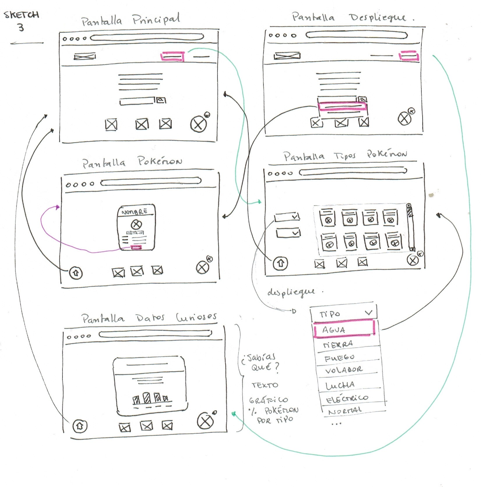

Los anteriores sketches e iteraciones las puedes visualizar en el siguiente link:
https://drive.google.com/open?id=169csG16pWxExXOueUKwJkX-CY9aiwVPx

### Prototipo Alta Fidelidad
Realizamos la interfaz de usuario en la aplicación Figma, puedes verla e interactuar con ella en el siguiente link:
https://www.figma.com/file/jf4ZC75JqB4kTPyqAlhYmo/Alta-Fidelidad?node-id=28%3A6

| Primera Pantalla
| -------------------------- |

    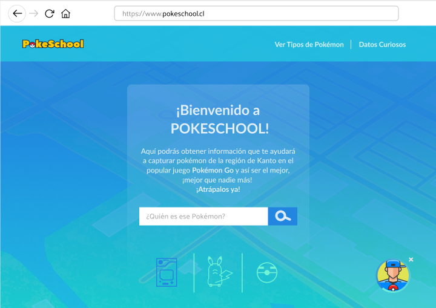

| Despliegue Buscador
| -------------------------- |

    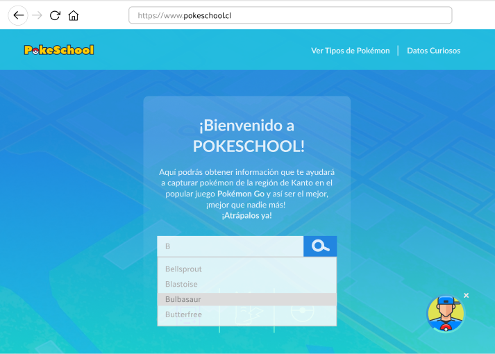

| Pantalla Pokémon
| -------------------------- |

    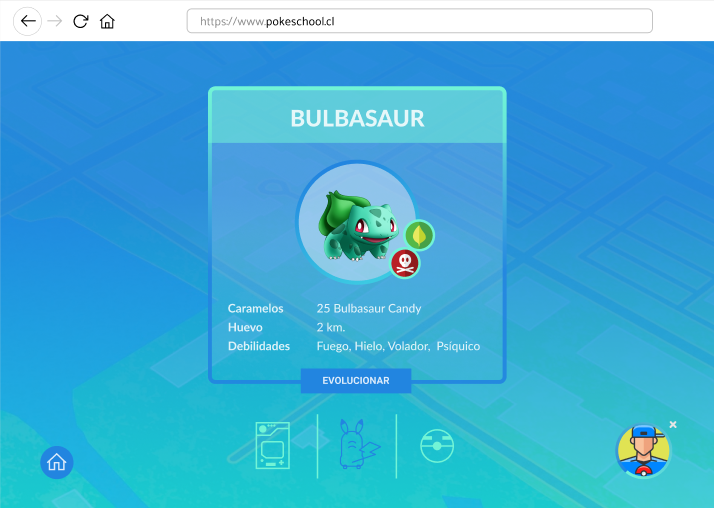

| Pantalla Tipos / Despliegue
| -------------------------- |

    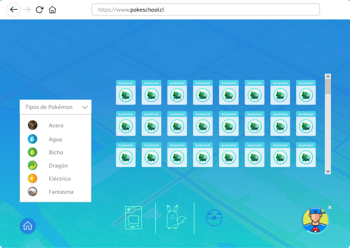

| Pantalla Tipos / Despliegue Ordenar
| -------------------------- |

    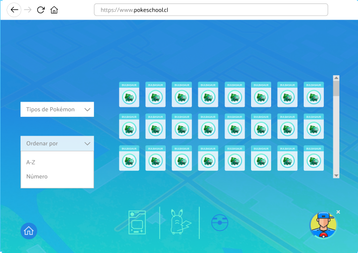

| Pantalla Datos Curiosos
| -------------------------- |

    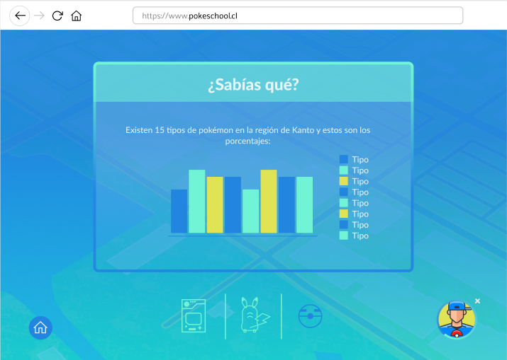

### Fundamentos Prototipo 
- Los colores fueron escogidos en base a la aplicación Pokémon Go, específicamente relacionados con el gimnasio.

- El logotipo posee una tipografía sans serif, geométrica y con colores representativos del logotipo original de la serie Pokémon, integrando el isotipo tan característico (pokebola).

- La tipografía del contenido es Lato,la misma que está presente en la aplicación Pokémon Go,utilizando cuerpos bold y regular, destacando en tamaños más grandes los títulos.

- Los íconos, palabras y contenidos utilizados se definen en base a la información rescatada de nuestra encuesta.

## SITIO WEB POKESCHOOL

### ¿Por qué PokeSchool?
El nombre **PokeSchool** nace por juegos de palabras, como 
decir _"¡Poke es Cool!"_ y además por el concepto de escuela, donde el usuario, además de obtener información relevante para jugar Pokémon Go, conocerá y aprenderá sobre los pokémon de la región de Kanto.

### ¿Dónde encontrar el sitio?
La aplicación se encuentra disponible en la web, sólo debes abrir el navegador de tu computador o dispositivo móvil e ingresar a la página a través del siguiente link:

https://gloriamoraga.github.io/scl-2018-12-bc-core-data-lovers/

### ¿Cómo funciona PokeSchool?

- Debes abrir el navegador y escribir el sitio www.pokeschool.cl

- Para buscar un pokémon específico de la región de Kanto, debes ingresar el nombre en la barra de búsqueda, donde dice **¿quién es ese pokémon?**.Si no sabes bien el nombre ¡no te preocupes!, ya que con sólo ingresar una letra aparecerán sugerencias de pokémon, luego debes pinchar el **botón de búsqueda** (lupa) y aparecerá tu pokémon.

- Si quieres conocer los tipos de pokémon, puedes ir al menú (ubicado en la esquina superior derecha) y seleccionar "Tipos de Pokémon". En esta página podrás visualizar los 151 pokémon de la región de Kanto y también sólo por tipo; podrás ordenarlos por orden alfabético y por número (designado en la pokedex).

- Si quieres saber un dato curioso, puedes ir al menú (ubicado en la esquina superior derecha) y seleccionar **Datos Curiosos**.

- ¿Necesitas **ayuda** sobre cómo usar nuestra página y conocer de qué se trata?, ¡sólo debes ir con Ash!, lo puedes encontrar en la esquina inferior derecha, hacer click y verás las indicaciones.

### Funcionalidad
Para el desarrollo de esta página se utilizó lenguaje JavaScript (ES6), Vanilla Javascript, HTML5 y CSS, framework Bulma y chart google.

### Ejemplo de Búsqueda
En la barra de texto ingreso la letra _"F"_, inmediatamente y automaticamente se deplegarán los nombres de pokémon con la letra _"F"_: _"Fearow"_, _"Farfetch'd"_, _"Flareon"_, selecciono el que quiero ver: **Flareon**, luego hago click en el botón buscar (lupa) y aparecerá el nombre del pokémon, su imagen, datos como: caramelos, huevo,debilidades y evolución (en el caso que la tenga).

### Testeo de Usabilidad
- En la primera etapa los usuarios vieron la primera pantalla, indicaron entender que se trataba de Pokémon y que en ella se podían buscar pokémon (en este testeo sólo se mostró la pantalla principal y sin interacción).

- En el último testeo los usuarios pudieron interactuar con la página y dentro de sus comentarios indicaron que les parecía muy bien que al ingresar una letra aparecieran sugerencias de nombres de pokémon con esa letra. Otra de sus observaciones fue que lo que nosotras diseñamos como "posición de la pantalla", ello/as lo relacionaron con un botón.

## Actualización
En base a los últimos testeos se volvieron a realizar sketches y prototipo en alta definición, así que ahora podrás ver las nuevas actualizaciones de **PokeSchool** en el siguiente link:
https://www.figma.com/file/ExV2M2YWFDpXGIWFLVB2EPYM/Iteraci%C3%B3n-PokeSchool?node-id=0%3A1

| Sketch
| -------------------------- |

    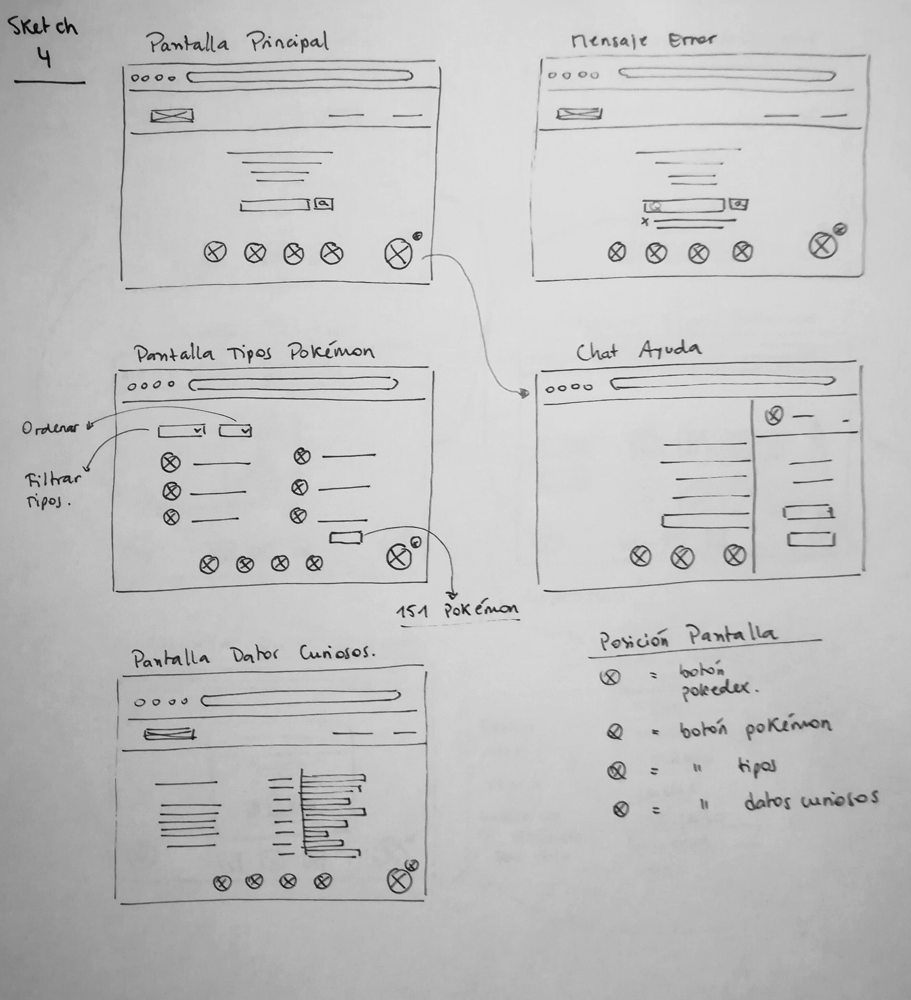

### Prototipo Alta Definición
| Mensaje Error
| -------------------------- |

    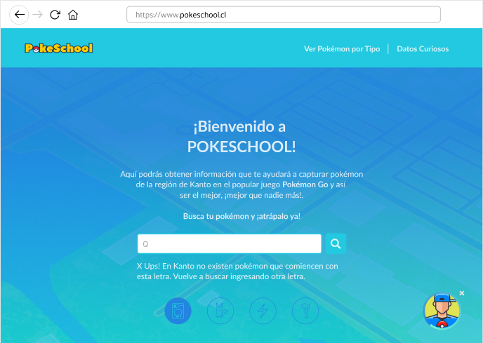

| Pokémon
| -------------------------- |

    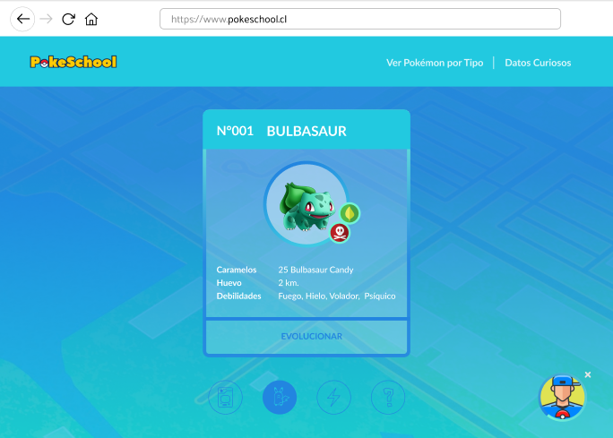

| Chat Ayuda
| -------------------------- |

    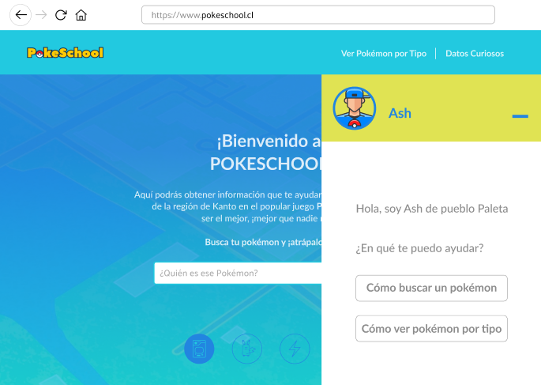

| Tipos Pokémon / Ordenar
| -------------------------- |

    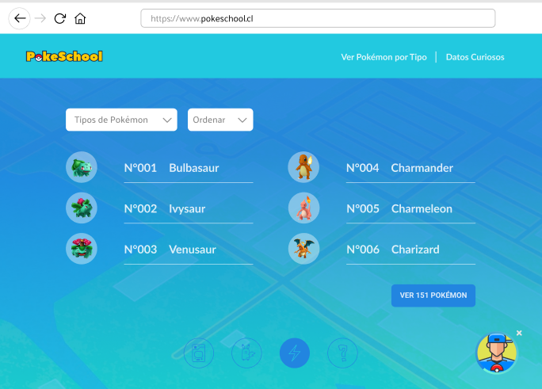

## Heurística
Para cumplir con las actualizaciones de la página y detectar aspectos a mejorar, se realizó el método heurística que puedes ver en mayor detalle dirigiéndote al siguiente link:
https://drive.google.com/file/d/1nSPYcgmD_CGD-_Z13AmeYq0BFkVp34Kj/view?usp=sharing

## Nuevos Testeos Usabilidad
Luego de esta actualización, se volvieron a realizar testeos de los que se concluye lo siguiente:

- Los usuarios definen la página como intuitiva, aunque nuevamente genera un poco de confusión los botones de posición de pantalla, ya que debería incluir algún texto que acompañe los íconos para su mejor comprensión. Los usuarios cumplen las tareas a realizar y coincide su interacción en el botón ordenar para visualizar los 151 pokémon, por lo tanto son en estos puntos donde se debe volver a iterar para las próximas actualizaciones.

Puedes ver los videos de algunos testeos en el siguiente link:
https://drive.google.com/drive/folders/1LxuWLHxvKo9RJCYjC2M0pywEtsaepUUe?usp=sharing

## Otros / Planificación
Puedes ver nuestra planificación para el desarrollo de este proyecto en el siguiente link: https://trello.com/b/ViKlof4v/data-lovers

Nuevas tareas realizadas en:
https://trello.com/b/kBNtsZ5c/extensi%C3%B3n-data-lovers